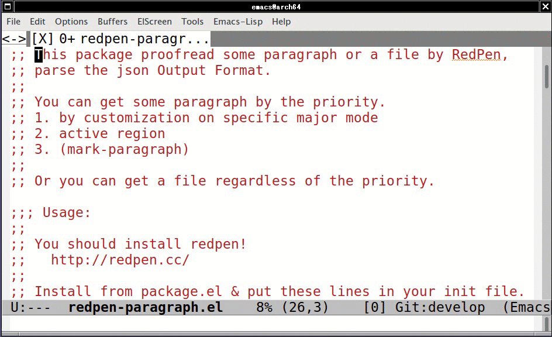

# redpen-paragraph.el

RedPen interface for proofreading paragraph.

## Screenshot

## Install

You should install RedPen!
  http://redpen.cc/

M-x list-packages, install 'redpen-paragraph'.

## Usage

#### `M-x redpen-paragraph`

Read 'Usage:' comment for setting 'redpen-commands' & key binding.
